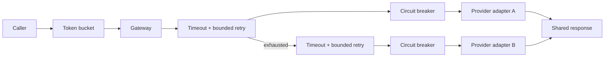

# Gateway architecture

## Scope

The first release slice establishes local resilience primitives without calling
real AI APIs. The gateway accepts one shared request schema, tries providers in
declared order, and returns the first successful response in a shared response
schema. Provider-specific SDKs, streaming, tool calls, cost accounting, and
tracing remain later roadmap work.

## Policy order

1. The local token bucket rejects excess work before a request ID or provider
   call is created.
2. Each provider receives a bounded number of attempts. Backoff is exponential
   and capped; both sleep and clock functions are injectable for deterministic
   tests.
3. Every attempt races the adapter against a timeout, so even an adapter that
   ignores its abort signal cannot hold the gateway open forever.
4. A circuit-wrapped adapter counts operational failures, opens at its threshold,
   rejects traffic while open, and permits one half-open recovery probe after the
   reset interval.
5. After one provider exhausts its attempts, the gateway tries the next adapter.
   Caller cancellation and invalid input stop immediately instead of falling back.

## Failure taxonomy

| Kind | Retry same provider | Fallback | Circuit failure |
| --- | --- | --- | --- |
| `rate_limited` | Yes | Yes | Yes |
| `timeout` | Yes | Yes | Yes |
| `unavailable` | Yes | Yes | Yes |
| `authentication` | No | Yes | No |
| `internal` | No | Yes | No |
| `invalid_request` | No | No | No |
| `invalid_response` | No | Yes | No |
| `aborted` | No | No | No |

The local gateway rate limiter itself runs before provider selection and
therefore does not trigger provider fallback. The table describes classified
provider failures.

## Composition boundaries

Adapters own protocol translation only. Retry and timeout behavior lives in the
gateway, while circuit breaking is an explicit adapter wrapper. This keeps each
policy independently testable and makes policy order visible at construction.
Mocks implement the same public adapter contract as future real providers; the
chaos suite does not use privileged test-only gateway hooks.

## Current limitations

- The token bucket is process-local and is not a distributed quota system.
- Retry backoff has no jitter yet; deterministic behavior is intentional for
  the initial contract and will be revisited with observability evidence.
- An adapter that ignores abort may continue its own background work even though
  the caller has already received a timeout. Real adapters must honor the signal.
- The circuit state is in memory and is reset when the process restarts.
- No real provider credentials, service claims, or production benchmarks are
  included in this phase.

