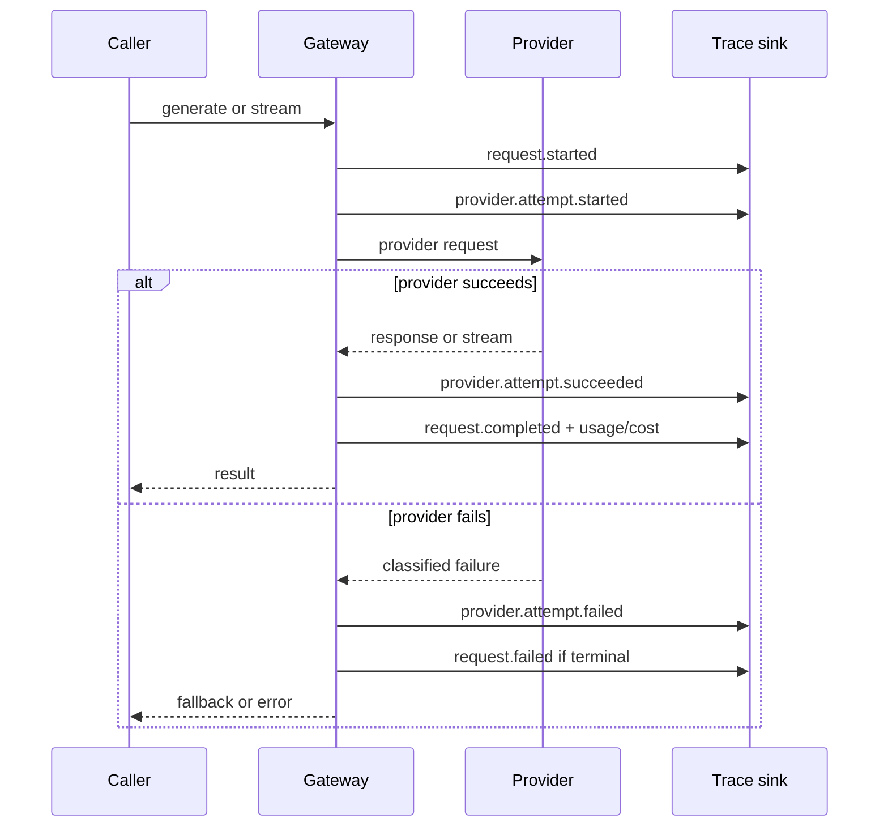

# Observability contract

The gateway emits provider-neutral lifecycle events through an injected
`TraceSink`. Events correlate on `requestId` and report operation, model,
provider, attempt number, elapsed milliseconds, token usage, estimated USD cost,
and normalized failure kinds. Prompt messages, generated text, request metadata,
error messages, credentials, and raw exception causes are deliberately excluded.

## Quick start

```ts
import {
  Gateway,
  InMemoryTraceSink,
  PricingCatalog,
  createEchoMockAdapter,
} from "multi-provider-ai-gateway";

const traceSink = new InMemoryTraceSink();
const gateway = new Gateway([createEchoMockAdapter("mock", "echo: ")], {
  traceSink,
  pricingCatalog: new PricingCatalog([
    {
      provider: "mock",
      model: "mock-small",
      inputUsdPerMillionTokens: 2,
      outputUsdPerMillionTokens: 8,
    },
  ]),
});

await gateway.generate({
  model: "mock-small",
  messages: [{ role: "user", content: "hello" }],
});
console.log(traceSink.snapshot());
```

After `npm run build`, run `npm run demo:observability` for a complete local
trace using the mock adapter. Pricing is configuration supplied by the host; the
package does not ship vendor prices that can silently become stale. Unknown
provider/model pairs still report usage but omit the cost estimate.

## Local aggregation and dashboard

`summarizeTraceEvents()` aggregates terminal request events into request,
token, estimated-cost, and latency totals. It also groups provider attempts so
fallback behavior and adapter reliability remain visible. Provider rows use
attempt latency, while the headline latency distribution uses end-to-end
request duration. Percentiles use the nearest-rank method over the recorded
sample; no interpolation or statistical significance is implied.

```ts
import {
  InMemoryTraceSink,
  renderTraceDashboard,
  summarizeTraceEvents,
} from "multi-provider-ai-gateway";

const traceSink = new InMemoryTraceSink({ maxEvents: 1_000 });
// Pass traceSink to Gateway, then serve requests.
const summary = summarizeTraceEvents(traceSink.snapshot());
console.log(renderTraceDashboard(summary));
```

Run `npm run demo:dashboard` to execute three deterministic local mock requests,
including a primary-provider failure and fallback, and render the resulting
Markdown dashboard. The output contains no prompts or generated text.

## Event sequence



Trace sinks are best-effort: exceptions thrown by a sink are ignored so a
monitoring outage cannot become a serving outage. `InMemoryTraceSink` is intended
for tests, examples, and bounded local inspection. It retains the newest 1,000
events by default, accepts a positive `maxEvents` override, and exposes the count
of dropped events. Clearing the sink also clears that counter. A summary made
after events were dropped covers only the retained window and must not be treated
as a complete historical report. Production hosts should send events to a
bounded, non-blocking collector and define their own retention.

Costs are arithmetic estimates from reported token counts, rounded to 12 decimal
places. They are not invoices and do not include provider-specific discounts,
cached-token rules, taxes, or non-token charges.

The `pricedRequests` field makes cost coverage explicit: completed requests with
unknown provider/model pricing still contribute token and latency totals but not
the estimated USD sum. Dashboard data is process-local and ephemeral; it is not
a persistence, billing, alerting, or production monitoring system.
